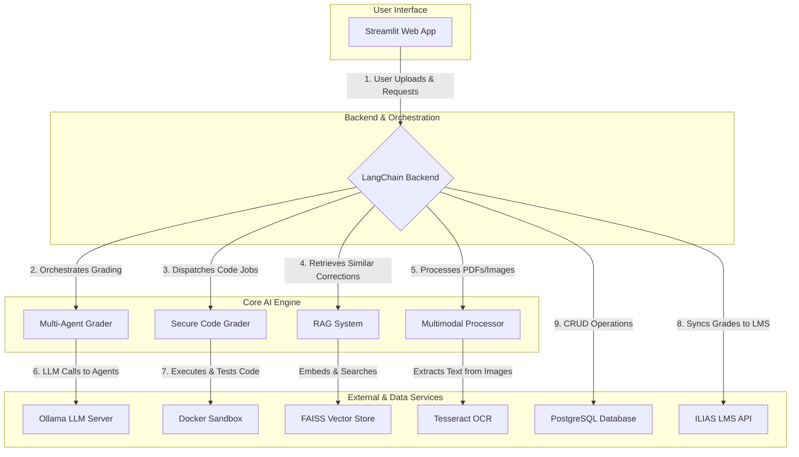

# 🤖 AI Grading Framework: A LangChain Multi-Agent System

## 1. Introduction

This document provides a comprehensive overview of the AI Grading Framework, a project born from a master's thesis and designed to evolve into a robust, open-source tool for the academic community. The framework leverages a **Multi-Agent RAG (Retrieval-Augmented Generation)** architecture to address the core challenges of consistency, reliability, and transparency in automated academic assessment.

---

## 2. System Architecture

### 2.1. High-Level Overview

The system is designed as a modular, containerized application orchestrated by a central backend. It integrates multiple specialized AI and machine learning components to handle diverse grading tasks, from code evaluation to the assessment of handwritten answers.

### 2.2. Core Components

| Component | Description |
| :--- | :--- |
| **Multi-Agent Grader** | At the heart of the system is a team of AI agents, each with a distinct persona (e.g., "strict," "lenient," "creative"). They grade assignments concurrently, and their outputs are aggregated to form a consensus score and synthesized feedback. This reduces bias and improves reliability. |
| **RAG System** | The framework builds an institutional memory by storing human-verified grades and feedback in a FAISS vector store. When a new assignment is graded, the system retrieves the most similar past corrections, providing the AI agents with relevant context to ensure consistency over time. |
| **Secure Code Grader** | To safely evaluate programming assignments, student code is executed within a sandboxed Docker container. The system runs predefined `unittest` cases to assess correctness and uses a specialized AI agent to provide feedback on code quality, style, and efficiency. |
| **Multimodal Processor** | For assignments with handwritten answers or diagrams, the system employs a pipeline that uses Tesseract for OCR and is designed to integrate with Firebase ML Kit for more advanced image analysis. |

### 2.3. Data and ETL Pipelines

- **Ingestion**: The primary data sources are student submissions, which can be in various formats (PDF, `.py` files, images). These are ingested through the Streamlit frontend or synced directly from the ILIAS LMS.
- **Transformation**: Text is extracted, code is prepared for execution, and images are processed through the OCR pipeline. Submissions and grading criteria are converted into embeddings using Sentence-Transformers and stored in the FAISS vector store.
- **Loading**: Final grades, AI-generated feedback, and human corrections are loaded into a PostgreSQL database, creating a structured, long-term record. This data is also used to fine-tune the RAG system and analytics dashboards.

---

## 3. Technology Stack

| Category | Technology | Purpose |
| :--- | :--- | :--- |
| **AI Orchestration** | LangChain | The core framework for building and managing the multi-agent system, coordinating LLM calls, and structuring interactions. |
| **LLM Serving** | Ollama | Serves open-source models like Mistral and Llama locally, ensuring data privacy and control. |
| **Vector Database** | FAISS | Powers the RAG system by enabling efficient similarity searches on high-dimensional vectors. |
| **Embeddings** | Sentence-Transformers | Generates the vector embeddings for both student submissions and the knowledge base. |
| **Web Framework** | Streamlit | Provides the user interface for educators to upload assignments, review grades, and view analytics. |
| **Database** | PostgreSQL, SQLAlchemy | Manages all structured data, including student records, grades, and feedback. |
| **Containerization** | Docker | Creates isolated sandboxes for secure code execution and ensures a reproducible deployment environment. |

---

## 4. Project Roadmap

The project's roadmap is designed to transition it from a powerful academic framework into a mature, community-driven platform.

- **Formalize MLOps Pipelines**: Implement a full MLOps workflow using tools like MLflow for versioning datasets, prompts, and models. This will ensure that every grade is reproducible and traceable.
- **Deepen Dashboard Analytics**: Enhance the Professor Dashboard with predictive analytics to identify at-risk students and provide detailed variance analysis between the different AI grading agents.
- **Advanced Multimodal Understanding**: Move beyond basic OCR to models capable of interpreting complex handwritten mathematical formulas and scientific diagrams.
- **Create a Community Hub**: Build a platform for educators to share, rate, and reuse effective grading rubrics and agent personas, fostering a community-driven library of best practices.
- **Expand API & LMS Integrations**: Develop a versioned REST API for the grading engine to allow for deeper integrations with a wider range of institutional tools, including other LMS platforms like Canvas and Moodle.

---

## 5. Getting Involved

This is an open-source project, and contributions are welcome. Whether you're interested in fixing bugs, adding new features, or improving the documentation, please feel free to fork the repository and submit a pull request. 
