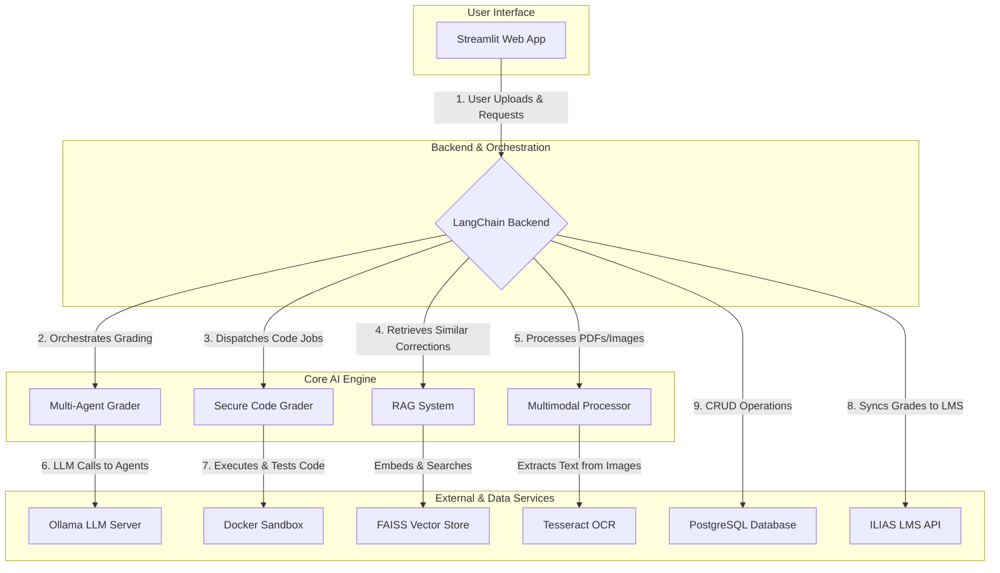

# 🤖 AI Grading Framework: A LangChain Multi-Agent System

[](https://www.gnu.org/licenses/gpl-3.0)
[](https://www.python.org/downloads/release/python-380/)

An advanced academic grading framework built on **LangChain** that leverages a **Multi-Agent RAG architecture** to deliver reliable, consistent, and transparent assessments. This project moves beyond the limitations of single-model systems by simulating a human grading committee, complete with specialized AI agents, a long-term memory, and full LMS integration.

<div align="center">

*Placeholder for Project Demo GIF - A short, animated demonstration of the UI in action would go here.*

</div>

---

### 🤔 Why This Framework?

While single-model LLMs can grade assignments, they suffer from inherent non-determinism and can be easily influenced by subtle changes in prompt phrasing. This leads to inconsistent and unreliable results—a critical failure for educational tools. 

This framework solves that problem by simulating a human grading committee. By instantiating a team of AI agents with diverse personas (e.g., a "strict" grader, a "lenient" one), we introduce multiple perspectives. Their scores are then aggregated into a consensus, and their feedback is synthesized by a "meta-agent." This multi-agent approach significantly reduces bias and variance, leading to more robust, reliable, and trustworthy evaluations.

---

### 🏗️ Architectural Overview

This diagram illustrates the flow of data and interaction between the core components of the system.



---

### ✨ Core Features

<div align="center">

| Feature | Description |
| :---: | :--- |
| 🤖 **Multi-Agent Collaboration** | Simulates a peer review using a team of LangChain agents to grade concurrently, ensuring fairer, more robust, and less biased scoring through consensus. |
| 💡 **Explainable AI** | Delivers transparent, rubric-aligned justifications for every score. Understand not just the *what*, but the *why* behind each grade. |
| 🧠 **RAG-Powered Consistency** | Leverages a FAISS vector store to build an institutional memory from human-verified corrections, ensuring consistent application of standards over time. |
| 📊 **Professor Dashboard** | Provides rich analytics on student performance, question difficulty, and grading consistency across the entire class. |
| 🌍 **Multilingual Support** | Capable of grading assignments and providing feedback in over 50 languages, with a robust model for on-device translation and language identification. |
| 🔒 **Secure Code Evaluation** | Executes programming assignments in an isolated Docker sandbox, combining objective `unittest` results with qualitative AI feedback on code style. |
| 🧑‍🏫 **Human-in-the-Loop** | Provides educators with an intuitive UI to review, edit, and finalize all AI-generated grades, ensuring they always have the final say. |
| 🔌 **LMS Integration** | Features built-in connectivity for the **ILIAS** Learning Management System, with a modular design for future platform support. |
| 🖼️ **Multimodal Grading** | Actively grades image-based answers and diagrams using an integrated **Tesseract OCR** and **Firebase ML Kit** pipeline. |

</div>

---

### 🛠️ Technology Stack

*A comprehensive list of the key technologies and libraries used in this project.*

<p align="center">
  <b>AI Orchestration & Agents</b><br>
  
  
</p>
<p align="center">
  <b>RAG, Embeddings & Multimodal</b><br>
  
  
  
  
</p>
<p align="center">
  <b>Core, Backend & Frontend</b><br>
  
  
  
  
</p>
<p align="center">
  <b>Infrastructure & Tooling</b><br>
  
  
</p>

---

### 📂 Project Structure

```
multi-agent-llm-grader/
├── 📄 .gitignore
├── 🐳 Dockerfile
├── 🔑 credentials.yaml
├── 📦 requirements.txt
├── 📜 LICENSE
├── 🖼️ README.md
├── 🚀 app.py                 # Main Streamlit application entry point
├── 🔌 ilias_api.py           # Handles ILIAS LMS connectivity
├── 💾 init_db.py             # Initializes the database schema
|
├── 📂 database/             # Manages all database interactions
│   ├── models.py            # SQLAlchemy ORM models
│   └── postgres_handler.py  # Core database logic
|
├── 📂 grader_engine/        # The core AI grading logic
│   ├── multi_agent_grader.py # Main multi-agent orchestration
│   └── secure_code_grader.py # Secure code execution via Docker
|
├── 📂 pages/                # Additional Streamlit pages
│   ├── 1_✍️_Manual_Grading.py
│   └── 2_📊_Grading_Analytics.py
|
└── 📂 templates/            # Code templates for assignments
    └── code_template.py
```

---

## 🚀 Installation & Usage

**Prerequisites:** Ensure **Python 3.8+**, **Docker**, **PostgreSQL**, and **Ollama** are installed and running.

**1. Clone & Install**
```bash
git clone https://github.com/vedant-m/multi-agent-llm-grader.git
cd multi-agent-llm-grader
pip install -r requirements.txt
```

**2. Configure Environment**

All credentials and sensitive information are managed in `credentials.yaml`.

- Create the file: `cp credentials.yaml.template credentials.yaml`
- Edit `credentials.yaml` with your details:

```yaml
# credentials.yaml
postgres:
  user: "vedant"
  password: "vedant"
  host: "localhost"
  port: "5432"
  dbname: "autograder_db"

ilias:
  # ILIAS API endpoint, user, and password
  endpoint: "https://your-ilias-instance.com/webservice/soap/server.php"
  user: "ilias-api-user"
  password: "api-password"
```

**3. Database & Model Setup**
```bash
# From a SQL client, create the database and user defined in your YAML
CREATE DATABASE autograder_db;

# Initialize the schema
python init_db.py

# Pull the LLM via Ollama
ollama pull mistral
```

**4. Launch the Application**
```bash
streamlit run app.py
```
Navigate to `http://localhost:8501` to begin!

---

### ⚙️ Deployment & Security

- **Deployment:** For a production-like setup, it is highly recommended to use Docker Compose to orchestrate the Streamlit app, the PostgreSQL database, and the Ollama server. This ensures a consistent and reproducible environment.

- **Security:** This framework is designed with security in mind. The `Secure Code Grader` executes all student code in a fully isolated Docker container to prevent any access to the host system. Always manage credentials securely in `credentials.yaml` and use file permissions to restrict access; never hard-code them.

---

### ❓ Troubleshooting & FAQ

- **`OperationalError: connection to server failed`**: This error almost always means the PostgreSQL server is not running or the credentials in `credentials.yaml` are incorrect. Ensure the database server is active and double-check your username, password, host, and database name.

- **`Docker is not running`**: The Secure Code Grader requires the Docker daemon to be active. Make sure you have started Docker Desktop or the Docker service on your system before running the application.

- **`Ollama model not found`**: Ensure the Ollama application is running and that you have successfully pulled the required model by running `ollama pull mistral` in your terminal.

- **`ModuleNotFoundError`**: If you see this after installation, your Python environment may not be configured correctly. Ensure you are running `streamlit run app.py` from the same virtual environment where you installed the `requirements.txt` packages.

---

### 🗺️ Project Roadmap

- [ ] **Full MLOps Integration:** Implement an end-to-end MLflow pipeline for tracking experiments and versioning models, prompts, and feedback.
- [ ] **Expand LMS Connectors:** Develop production-ready connectors for other popular LMS platforms like Canvas and Moodle.
- [ ] **Advanced Multimodal:** Enhance OCR capabilities for complex handwritten formulas and low-quality images using advanced computer vision models.
- [ ] **Support for More LLMs:** Deepen the model-agnostic design by adding official support for other major APIs like OpenAI's GPT series and Google's Gemini family.
- [ ] **Enhanced Analytics:** Build out the analytics dashboard to provide educators with deeper insights into class performance and grading consistency.

---

## 🤝 Contributing

Contributions are the lifeblood of the open-source community. If you have ideas for improvements, bug fixes, or new features, please don't hesitate to fork the repo and create a pull request. Every contribution, no matter how small, is **greatly appreciated**.

---

## 👨‍💻 About the Author

This project was developed by **Vedant Shivnekar.** as a dedicated effort to explore the frontiers of AI in education. Driven by a passion for building reliable and practical machine learning systems, this framework is a testament to the potential of multi-agent architectures.

### Connect with Me

<p align="left">
  <a href="https://github.com/vedant-m" target="_blank"></a>
  <a href="https://www.linkedin.com/in/your-linkedin-profile/" target="_blank"></a>
  <a href="mailto:your-email@example.com"></a>
</p>

---

## 📜 License

Distributed under the **GNU General Public License v3.0**. See `LICENSE` for more information.
